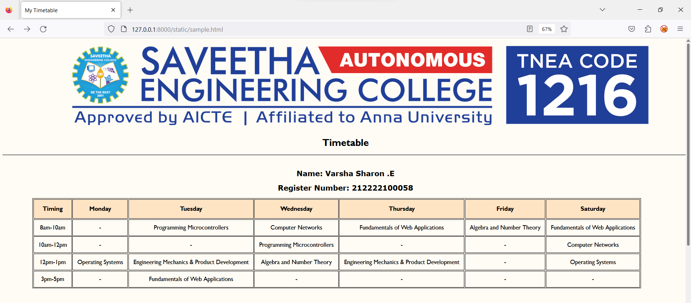

# Ex03 Time Table

## AIM
To write a html webpage page to display your slot timetable.

## ALGORITHM
### STEP 1
Create a Django-admin Interface.

### STEP 2
Create a static folder and inert HTML code.

### STEP 3
Create a simple table using ```<table>``` tag in html.

### STEP 4
Add header row using ```<th>``` tag.

### STEP 5
Add your timetable using ```<td>``` tag.

### STEP 6
Execute the program using runserver command.

## CODE
```
<html lang="en">
<head>
    <meta charset="UTF-8">
    <meta name="viewport" content="width=device-width, initial-scale=1.0">
    <title>My Timetable</title>
    <link rel="stylesheet" href="sty.css">
</head>
<body>
    
    <div class="timetable">
        <h1>Timetable</h1>
        <hr>
        <br>
        <div class="info">
            <h2>Name: Varsha Sharon .E</h2>
            <h2>Register Number: 212222100058</h2>
        </div>
        <table class="t2" cellspacing="2">
            <tr>
                <th>Timing</th>
                <th><b>Monday</b></th>
                <th><b>Tuesday</b></th>
                <th><b>Wednesday</b></th>
                <th><b>Thursday</b></th>
                <th><b>Friday</b></th>
                <th><b>Saturday</b></th>
            </tr>
            <tr>
                <td>8am-10am</td>
                <td>-</td>
                <td>Programming Microcontrollers</td>
                <td>Computer Networks</td>
                <td>Fundamentals of Web Applications</td>
                <td>Algebra and Number Theory</td>
                <td>Fundamentals of Web Applications</td>
            </tr>
            <tr>
                <td>10am-12pm</td>
                <td>-</td>
                <td>-</td>
                <td>Programming Microcontrollers</td>
                <td>-</td>
                <td>-</td>
                <td>Computer Networks</td>
            </tr>

            <tr>
                <td>12pm-1pm</td>
                <td>Operating Systems</td>
                <td>Engineering Mechanics & Product Development</td>
                <td>Algebra and Number Theory</td>
                <td>Engineering Mechanics & Product Development</td>
                <td>-</td>
                <td>Operating Systems</td>
            </tr>
            <tr>
                <td>3pm-5pm</td>
                <td>-</td>
                <td>Fundamentals of Web Applications</td>
                <td>-</td>
                <td>-</td>
                <td>-</td>
                <td>-</td>
            </tr>
        </table>
        <br>
        <table class="t3" cellspacing="10">
            <tr>
                <th>
                    <b>S.No.</b>
                </th>
                <th><b>Subject Code</b></th>
                <th><b>Subject Name</b></th>
            </tr>
            <tr>
                <td>1.</td>
                <td>19AI414</td>
                <td>Fundamentals of Web Application Development</td>
            </tr>
            <tr>
                <td>2.</td>
                <td>19AI303</td>
                <td>Engineering Mechanics and Product Development</td>
            </tr>
            <tr>
                <td>3.</td>
                <td>19CS405</td>
                <td>Operating Systems</td>
            </tr>
            <tr>
                <td>4.</td>
                <td>19CS406</td>
                <td>Computer Networks</td>
            </tr>
            <tr>
                <td>5.</td>
                <td>19EE309</td>
                <td>Programming Microcontrollers</td>
            </tr>
            <tr>
                <td>6.</td>
                <td>19MA212</td>
                <td>Algebra and Number Theory</td>
            </tr>
            <tr>
                <td>7.</td>
                <td>19MC802</td>
                <td>Environmental Science</td>
            </tr>

        </table>
        <br>
        <br>
    </div>
    </body>
</html>

 <!--css-->
body{
    background-color:#fffcf5;
}
img{
    margin-left: 425px;
}
h2{
    font-family: Verdana, Geneva, Tahoma, sans-serif;
}
.timetable{
    font-family: 'Gill Sans', 'Gill Sans MT', Calibri, 'Trebuchet MS', sans-serif;
    text-align: center;
}
.t2{
    margin: 0 100 100 100;
    font-size: 20px;
    border: 1px solid;
}
.t2 th{
    background-color: bisque;
    padding: 20px;
    border: 1px solid;
    border-collapse: collapse;
    text-align: center;
}
.t2 td{
    border: 1px solid;
    padding: 15px;
    text-align: center;
}
.t3{
    margin: auto;
    font-size: 20px;
    border: 1px solid;
}
.t3 th{
    background-color: rgb(255, 241, 223);
    padding: 30px;
    border: 1px solid;
    border-collapse: collapse;
    text-align: center;
}
.t3 td{
    border: 1px solid;
    padding: 25px;
    text-align: center;
}
```

## OUTPUT
(2.png)

## RESULT
The program for creating slot timetable using basic HTML tags is executed successfully.
